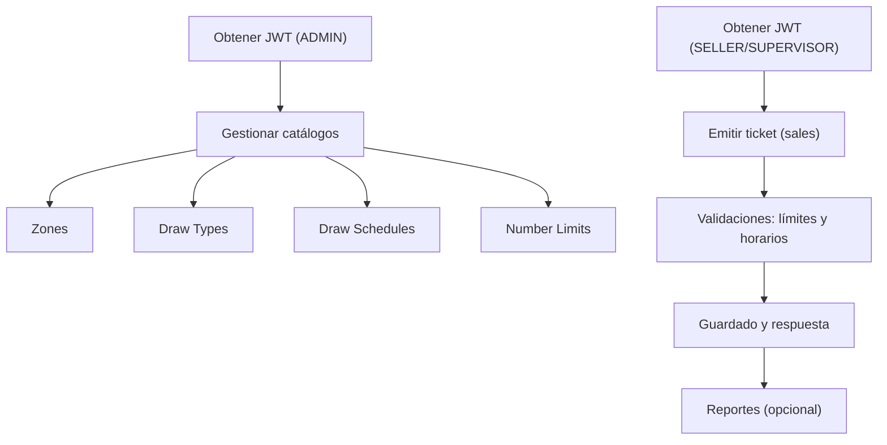

# 🎟️ Sistema de Emisión y Gestión de Tickets

Plataforma para gestionar catálogos (zonas, tipos de sorteo, horarios y límites), emisión de tickets y validaciones de negocio, con API basada en Django REST Framework.

## 📋 Índice
- Requisitos
- Instalación
- Ejecución
- Configuración
- Migraciones
- API
- Testing
- Performance Testing
- Frontend Components
- Calidad de Código
- CI/CD
- Troubleshooting
- Contribución

## ✅ Requisitos
- Python 3.12
- Docker y Docker Compose (opcional, recomendado)
- Redis (para cache y rate limiting)
- PostgreSQL (base de datos principal)

## ⚙️ Instalación
1. Clona el repositorio y entra al directorio del proyecto.
2. (Opcional) Crea un entorno virtual local:
   ```bash
   python -m venv .venv && source .venv/bin/activate
   ```
3. Instala dependencias:
   ```bash
   pip install -r requirements.txt
   pip install -r requirements-dev.txt
   ```

## 🚀 Ejecución
### Opción A: Docker (recomendada)
```bash
docker compose up -d --build
```
Aplicación disponible en `http://localhost:8000`.

### Opción B: Local
```bash
python manage.py migrate
python manage.py runserver 0.0.0.0:8000
```

## 🛠️ Configuración
Variables de entorno comunes:
- `DJANGO_SETTINGS_MODULE=core.settings`
- `SECRET_KEY=...`
- `DEBUG=true|false`
- `DATABASE_URL=...` (si aplica)

## 🗃️ Migraciones
Generar y aplicar migraciones:
```bash
python manage.py makemigrations
python manage.py migrate
```

## 🔌 API
- API REST con Django REST Framework.
- Endpoints principales (routers):
  - `zones/`
  - `draw-types/`
  - `draw-schedules/`
  - `number-limits/`
  - `tickets/`
  - `reports/`
- Autenticación JWT (SimpleJWT).
- Permisos: escritura restringida a `ADMIN`/`staff`/`superuser`.
- **Rate Limiting**: Protección contra abuso de API.
- **Cache Redis**: Optimización de reportes frecuentes.
- **Auditoría**: Logs automáticos de todas las acciones.

### Prefijos globales
- Catálogo: `/api/catalog/`
- Cuentas: `/api/auth/`
- Ventas: `/api/sales/`

### Ejemplos curl
1) Obtener token JWT
```bash
curl -X POST http://localhost:8000/api/auth/token/ \
  -H "Content-Type: application/json" \
  -d '{"username": "admin", "password": "admin123"}'
```

2) Crear zona (requiere token)
```bash
TOKEN=eyJ... # reemplazar por tu token
curl -X POST http://localhost:8000/api/catalog/zones/ \
  -H "Authorization: Bearer $TOKEN" \
  -H "Content-Type: application/json" \
  -d '{"name": "Zona Norte", "is_active": true}'
```

3) Listar tipos de sorteo
```bash
curl http://localhost:8000/api/catalog/draw-types/
```

4) Crear horario de sorteo (upsert por zona+tipo)
```bash
curl -X POST http://localhost:8000/api/catalog/draw-schedules/ \
  -H "Authorization: Bearer $TOKEN" \
  -H "Content-Type: application/json" \
  -d '{"zone": 1, "draw_type": 1, "cutoff_time": "18:00:00", "is_active": true}'
```

5) Establecer límite de número
```bash
curl -X POST http://localhost:8000/api/catalog/number-limits/ \
  -H "Authorization: Bearer $TOKEN" \
  -H "Content-Type: application/json" \
  -d '{"zone": 1, "draw_type": 1, "number": "12", "max_pieces": 100}'
```

### Ejemplos de actualización y borrado (PATCH/DELETE)
1) Actualizar zona
```bash
curl -X PATCH http://localhost:8000/api/catalog/zones/1/ \
  -H "Authorization: Bearer $TOKEN" \
  -H "Content-Type: application/json" \
  -d '{"name": "Zona Norte Actualizada", "is_active": true}'
```

2) Borrar tipo de sorteo
```bash
curl -X DELETE http://localhost:8000/api/catalog/draw-types/1/ \
  -H "Authorization: Bearer $TOKEN"
```

3) Actualizar límite de número
```bash
curl -X PATCH http://localhost:8000/api/catalog/number-limits/1/ \
  -H "Authorization: Bearer $TOKEN" \
  -H "Content-Type: application/json" \
  -d '{"max_pieces": 150}'
```

4) Borrar horario de sorteo
```bash
curl -X DELETE http://localhost:8000/api/catalog/draw-schedules/1/ \
  -H "Authorization: Bearer $TOKEN"
```

### Diagrama de flujo (alto nivel)


## 🧾 Ventas (sales)
Prefijo: `/api/sales/`

### Crear ticket
```bash
curl -X POST http://localhost:8000/api/sales/tickets/ \
  -H "Authorization: Bearer $TOKEN" \
  -H "Content-Type: application/json" \
  -d '{
    "zone": 1,
    "draw_type": 1,
    "items": [
      {"number": "12", "pieces": 3},
      {"number": "34", "pieces": 2}
    ]
  }'
```

Respuestas esperadas:
- 201 Created con `{ id, total_pieces, ... }`
- 400 Bad Request si:
  - No hay `draw-schedule` activo para la zona/sorteo
  - Se excede el tope acumulado de `number-limits`
  - `items` vacío o con valores inválidos (número no 00-99, piezas <= 0)

### Reporte resumen
```bash
curl "http://localhost:8000/api/sales/tickets/reports/summary/?group_by=zone"
```

Parámetros soportados:
- `group_by`: `zone` | `draw_type` | `user`
- Filtros: `start`, `end`, `zones`, `draws`, `users`, `daily`, `page`, `page_size`

#### Ejemplos de filtros combinados
1) Por zona + rango de fechas + múltiples zonas + desglose diario
```bash
curl "http://localhost:8000/api/sales/tickets/reports/summary/?group_by=zone&start=2024-01-01&end=2024-01-31&zones=1,2&daily=1"
```

2) Por tipo de sorteo + filtro por usuario + paginación
```bash
curl "http://localhost:8000/api/sales/tickets/reports/summary/?group_by=draw_type&users=7&page=2&page_size=5"
```

3) Por usuario + filtros de zona y sorteo específicos
```bash
curl "http://localhost:8000/api/sales/tickets/reports/summary/?group_by=user&zones=1&draws=2,3"
```

4) Combinado completo (fechas + zona + sorteo + usuario)
```bash
curl "http://localhost:8000/api/sales/tickets/reports/summary/?group_by=zone&start=2024-06-01&end=2024-06-30&zones=1&draws=3&users=10"
```

### Exportación
```bash
curl "http://localhost:8000/api/sales/tickets/reports/export/?format=csv&group_by=zone"
curl "http://localhost:8000/api/sales/tickets/reports/export/?format=excel&group_by=zone"
```

#### Exportación con filtros combinados
1) CSV por zona + fechas específicas
```bash
curl "http://localhost:8000/api/sales/tickets/reports/export/?format=csv&group_by=zone&start=2024-01-01&end=2024-01-31"
```

2) Excel por tipo de sorteo + filtro de zona
```bash
curl "http://localhost:8000/api/sales/tickets/reports/export/?format=excel&group_by=draw_type&zones=1,2"
```

3) CSV por usuario + filtros múltiples
```bash
curl "http://localhost:8000/api/sales/tickets/reports/export/?format=csv&group_by=user&zones=1&draws=2&start=2024-06-01"
```

4) Excel con desglose diario
```bash
curl "http://localhost:8000/api/sales/tickets/reports/export/?format=excel&group_by=zone&daily=1&start=2024-06-01&end=2024-06-30"
```

### PDF del ticket
```bash
curl -L "http://localhost:8000/api/sales/tickets/123/pdf/" -o ticket-123.pdf
curl "http://localhost:8000/api/sales/tickets/123/preview/"
```

## 🧪 Testing
Suite que valida modelos, serializers, viewsets, permisos y flujos de integración.

## ⚡ Comandos rápidos
- Iniciar app (Docker): `docker compose up -d --build`
- Desarrollo fullstack: `./scripts/dev.sh`
- Solo backend: `./scripts/dev.sh backend`
- Solo frontend: `./scripts/dev.sh frontend`
- Instalar dependencias: `./scripts/dev.sh install`
- Migraciones: `python manage.py makemigrations && python manage.py migrate`
- Tests rápidos: `python manage.py test -v 2`
- Tests por módulo: `python manage.py test catalog.tests -v 2`
- Lint+formato: `flake8 && black . && isort .`
- Borrar caché Python: `find . -type d -name "__pycache__" -exec rm -r {} +`

### Ejecutar todos los tests
```bash
python manage.py test -v 2
```

### Ejecutar por módulo/archivo
```bash
python manage.py test accounts.tests -v 2
python manage.py test catalog.tests -v 2
python manage.py test sales.tests -v 2
python manage.py test sales.tests_advanced -v 2
python manage.py test tests_integration -v 2
python manage.py test test_simple -v 2
```

### Ejecutar por clase/test específico
```bash
python manage.py test catalog.tests.ZoneViewSetTests -v 2
python manage.py test catalog.tests.ZoneViewSetTests.test_update_zone -v 2
```

### Pytest (opcional)
```bash
pytest
# Con cobertura
pytest --cov=accounts --cov=catalog --cov=sales --cov-report=term-missing
```

## 🎨 Frontend (Repositorio Separado)

El frontend del dashboard de administración está en un repositorio separado: **[tickets-admin-frontend](https://github.com/tu-usuario/tickets-admin-frontend)**

### Características del Frontend
- **Vue.js 3** con Composition API
- **Tailwind CSS** para estilos
- **Pinia** para gestión de estado
- **Chart.js** para gráficos
- **Diseño responsive** para móvil y desktop

### Desarrollo del Frontend
```bash
# Clonar repositorio frontend
git clone https://github.com/tu-usuario/tickets-admin-frontend.git
cd tickets-admin-frontend

# Instalar dependencias
npm install

# Ejecutar en desarrollo
npm run dev

# Construir para producción
npm run build
```

### Mover Frontend a Repositorio Separado
Si necesitas separar el frontend del repositorio actual:

```bash
# Ejecutar script de separación
./scripts/move_frontend.sh [ruta_destino]

# Ejemplo: mover a ../tickets-admin-frontend
./scripts/move_frontend.sh ../tickets-admin-frontend
```

### 🚀 Desarrollo Fullstack

El backend ahora incluye Node.js y npm para facilitar el desarrollo fullstack:

#### **Opción 1: Desde el Host (WSL2/Linux) - Recomendado**
```bash
# Desarrollo completo (backend + frontend)
./scripts/dev.sh

# Solo backend Django
./scripts/dev.sh backend

# Solo frontend Vue.js
./scripts/dev.sh frontend

# Instalar dependencias de ambos
./scripts/dev.sh install

# Construir frontend para producción
./scripts/dev.sh build
```

#### **Opción 2: Desde dentro del Contenedor Docker**
```bash
# Desarrollo completo (backend + frontend)
./scripts/dev-container.sh

# Solo backend Django
./scripts/dev-container.sh backend

# Solo frontend Vue.js (si está montado)
./scripts/dev-container.sh frontend

# Instalar dependencias del frontend
./scripts/dev-container.sh install
```

#### **Opción 3: Docker Compose para desarrollo**
```bash
# Iniciar todo el stack de desarrollo
docker-compose -f docker-compose.dev.yml up --build

# Servicios disponibles:
# - Backend: http://localhost:8000
# - Frontend: http://localhost:3000
# - API Docs: http://localhost:8000/api/docs/
# - Database: localhost:5433
# - Redis: localhost:6379
```

#### **Opción 4: Desarrollo manual**
```bash
# Terminal 1: Backend
python manage.py runserver 0.0.0.0:8000

# Terminal 2: Frontend
cd ../tickets-admin-frontend
npm install
npm run dev
```

### 📝 Notas importantes:

- **Desde el Host**: Usa `./scripts/dev.sh` - accede a ambos directorios directamente
- **Desde el Contenedor**: Usa `./scripts/dev-container.sh` - el frontend debe estar montado en `/frontend`
- **Docker Compose**: Automáticamente monta el frontend y proporciona Node.js/npm

## 🧹 Calidad de Código
```bash
flake8 accounts catalog sales --max-line-length=88
black accounts catalog sales
isort accounts catalog sales
bandit -r accounts catalog sales
```

## 🚀 Performance Testing

### Suite Completa de Tests de Rendimiento

El proyecto incluye una suite completa de tests de rendimiento para la **Fase 2**:

#### Tests Disponibles

1. **Database Benchmarks** (`scripts/db_benchmarks.py`)
   - Queries simples y complejas
   - Tests de concurrencia de base de datos
   - Análisis de rendimiento de índices
   - Reportes detallados con recomendaciones

2. **Memory Stress Tests** (`scripts/memory_stress_test.py`)
   - Detección de memory leaks
   - Tests de memoria en queries de base de datos
   - Tests de concurrencia de memoria
   - Tests de cache de memoria

3. **Concurrency Tests** (`sales/tests_concurrency.py`)
   - Creación concurrente de tickets
   - Generación concurrente de reportes
   - Operaciones mixtas (lectura/escritura)
   - Tests de pool de conexiones
   - Tests de rate limiting

4. **Load Tests** (`locustfile.py`)
   - Múltiples tipos de usuarios
   - Escenarios de carga ligera y pesada
   - Tests de reportes y administración

#### Ejecución de Tests

```bash
# Ejecutar toda la suite de tests
python scripts/run_performance_tests.py

# Tests individuales
python scripts/db_benchmarks.py
python scripts/memory_stress_test.py
python manage.py test sales.tests_concurrency --verbosity=2
locust -f locustfile.py --headless --users 10 --spawn-rate 2 --run-time 60s
```

#### Ejecución en Docker

```bash
# Construir y ejecutar tests en contenedor
docker compose -f docker-compose.dev.yml up -d
docker compose -f docker-compose.dev.yml exec backend python scripts/run_performance_tests.py
```

#### Interpretación de Resultados

**Umbrales Recomendados:**
- ✅ Queries simples: < 0.1s
- ✅ Queries complejas: < 1.0s
- ✅ Reportes: < 5.0s
- ✅ Memory leak: < 10MB
- ✅ Success rate: > 95%
- ✅ Response time: < 2.0s
- ✅ RPS: > 100

#### CI/CD Integration

Los tests de rendimiento se ejecutan automáticamente:
- **En Pull Requests**: Para verificar cambios
- **En Push a main/develop**: Para monitoreo continuo
- **Diariamente**: Para tendencias de rendimiento

**Artifacts generados:**
- `performance-reports/`: Reportes JSON y HTML
- `performance-dashboard/`: Dashboard de métricas
- Comentarios automáticos en PRs

#### Documentación Completa

Para más detalles, consulta: [`PERFORMANCE_TESTING.md`](./PERFORMANCE_TESTING.md)

## 🎨 Frontend Components

### Repositorios Frontend Implementados

El proyecto incluye tres repositorios frontend separados para la **Fase 2**:

#### 1. **Tickets Admin Frontend** (`tickets-admin-frontend`)
- **Propósito**: Interfaz administrativa completa
- **Tecnologías**: Vue.js 3 + Composition API, Pinia, Tailwind CSS
- **Características**: Gestión de catálogos, usuarios, reportes, configuración
- **Documentación**: [Ver README](./tickets-admin-frontend/README.md)

#### 2. **Tickets Admin Dashboard** (`tickets-admin-dashboard`)
- **Propósito**: Dashboard responsive para administradores
- **Tecnologías**: Vue.js 3, Chart.js, WebSockets
- **Características**: Métricas en tiempo real, widgets personalizables, notificaciones
- **Documentación**: [Ver README](./tickets-admin-dashboard/README.md)

#### 3. **Tickets Seller Interface** (`tickets-seller-interface`)
- **Propósito**: Interfaz optimizada para vendedores
- **Tecnologías**: Vue.js 3, PWA, Web Serial API
- **Características**: Emisión rápida de tickets, modo offline, impresión térmica
- **Documentación**: [Ver README](./tickets-seller-interface/README.md)

### Instalación y Desarrollo

```bash
# Clonar todos los repositorios
git clone <repository-url>/tickets-admin-frontend
git clone <repository-url>/tickets-admin-dashboard
git clone <repository-url>/tickets-seller-interface

# Instalar dependencias
cd tickets-admin-frontend && npm install
cd ../tickets-admin-dashboard && npm install
cd ../tickets-seller-interface && npm install

# Ejecutar en desarrollo
npm run dev  # En cada repositorio
```

### Integración con Backend

Todos los frontends se conectan al backend Django a través de:
- **API REST**: `/api/` endpoints
- **WebSockets**: `/ws/` para tiempo real
- **Autenticación**: JWT tokens
- **Rate Limiting**: Protección contra abuso

### Deployment

```bash
# Build de producción
npm run build

# Docker (cada repositorio)
docker build -t tickets-admin-frontend .
docker build -t tickets-admin-dashboard .
docker build -t tickets-seller-interface .
```

### Monitoreo y Métricas

#### Endpoints de Monitoreo

```bash
# Health check general
curl http://localhost:8000/api/health/

# Métricas de Prometheus
curl http://localhost:8000/metrics

# Estadísticas de cache
curl http://localhost:8000/api/sales/reports/cache/stats/

# Limpiar cache
curl -X POST http://localhost:8000/api/sales/reports/cache/clear/
```

#### Métricas Clave

- **Database Performance**: Query execution time, connection pool usage
- **Memory Usage**: Memory leaks, peak memory usage, garbage collection
- **API Performance**: Response times, throughput (RPS), error rates
- **Rate Limiting**: Requests blocked, rate limit headers, IP whitelist effectiveness
- **Cache Performance**: Hit rate, miss rate, cache size

#### Logs de Auditoría

Los logs de auditoría se guardan en:
- `logs/audit.log`: Acciones de usuarios y cambios en el sistema
- `logs/monitoring.log`: Métricas de rendimiento y monitoreo
- `logs/django.log`: Logs generales de Django

## 🔄 CI/CD (ejemplo GitHub Actions)

### Tests Unitarios y de Integración
```yaml
name: Tests
on: [push, pull_request]
jobs:
  test:
    runs-on: ubuntu-latest
    steps:
      - uses: actions/checkout@v3
      - uses: actions/setup-python@v4
        with:
          python-version: '3.12'
      - name: Install dependencies
        run: |
          pip install -r requirements.txt
          pip install -r requirements-dev.txt
      - name: Run tests
        run: python manage.py test -v 2
```

### Tests de Rendimiento
```yaml
name: Performance Tests
on:
  push:
    branches: [ main, develop ]
  pull_request:
    branches: [ main ]
  schedule:
    - cron: '0 2 * * *'  # Diariamente a las 2 AM UTC

jobs:
  performance-tests:
    runs-on: ubuntu-latest
    services:
      postgres:
        image: postgres:13
        env:
          POSTGRES_PASSWORD: postgres
          POSTGRES_DB: test_db
        ports:
          - 5432:5432
      redis:
        image: redis:6-alpine
        ports:
          - 6379:6379
    
    steps:
      - uses: actions/checkout@v3
      - uses: actions/setup-python@v4
        with:
          python-version: '3.11'
      - name: Install dependencies
        run: |
          pip install -r requirements.txt
          pip install -r requirements-dev.txt
          pip install locust psutil
      - name: Run performance tests
        run: python scripts/run_performance_tests.py
      - name: Upload performance reports
        uses: actions/upload-artifact@v3
        with:
          name: performance-reports
          path: performance-reports/
          retention-days: 30
```

## 🐛 Troubleshooting
- Usa siempre `manage.py test` para cargar `DJANGO_SETTINGS_MODULE` y evitar errores tipo:
  `ImproperlyConfigured: Requested setting REST_FRAMEWORK ...`.
- Si hay inconsistencias en la BD de tests, el runner recrea la DB automáticamente.
- Limpia caché de Python si ves comportamientos extraños:
  ```bash
  find . -type d -name "__pycache__" -exec rm -r {} +
  ```

## ❓ FAQ
- ¿Cómo evito el error de settings en tests?  
  Ejecuta siempre con `python manage.py test ...` (no ejecutes archivos de test directamente).
- ¿Por qué recibo 403 en endpoints de catálogo?  
  Acciones de escritura requieren `ADMIN`/`staff`/`superuser`. Asegúrate de enviar un JWT válido.
- ¿Cómo ejecuto un solo test?  
  `python manage.py test catalog.tests.ZoneViewSetTests.test_update_zone -v 2`
- ¿Cómo creo datos mínimos?  
  Usa los endpoints `zones/`, `draw-types/` y luego `draw-schedules/` para horarios.
- ¿Cómo ejecuto tests de rendimiento?  
  `python scripts/run_performance_tests.py` para toda la suite o tests individuales.
- ¿Dónde encuentro los reportes de rendimiento?  
  En el directorio `performance-reports/` después de ejecutar los tests.
- ¿Cómo interpreto los resultados de performance?  
  Consulta los umbrales recomendados en la sección de Performance Testing.

## 🚀 Performance Testing

### 📋 Descripción General

La suite de tests de rendimiento cubre:

- ✅ **Cache Redis para reportes frecuentes**
- ✅ **Validaciones de negocio más robustas**
- ✅ **Sistema de auditoría y logs**
- ✅ **API rate limiting**
- ✅ **Tests de rendimiento y carga**

### 🧪 Tests Implementados

#### 1. Database Benchmarks (`scripts/db_benchmarks.py`)
Mide el rendimiento de queries complejas y operaciones de base de datos.

**Características:**
- Queries simples y complejas
- Tests de concurrencia de base de datos
- Análisis de índices
- Reportes de rendimiento

**Ejecución:**
```bash
python scripts/db_benchmarks.py
```

#### 2. Memory Stress Tests (`scripts/memory_stress_test.py`)
Detecta memory leaks y mide el uso de memoria bajo carga.

**Características:**
- Detección de memory leaks
- Tests de memoria en queries
- Tests de concurrencia de memoria
- Tests de cache de memoria

**Ejecución:**
```bash
python scripts/memory_stress_test.py
```

#### 3. Concurrency Tests (`sales/tests_concurrency.py`)
Prueba el comportamiento del sistema bajo carga concurrente.

**Características:**
- Creación concurrente de tickets
- Generación concurrente de reportes
- Operaciones mixtas (lectura/escritura)
- Tests de pool de conexiones
- Tests de rate limiting

**Ejecución:**
```bash
python manage.py test sales.tests_concurrency --verbosity=2
```

#### 4. Load Tests (`locustfile.py`)
Tests de carga usando Locust para simular usuarios reales.

**Características:**
- Múltiples tipos de usuarios
- Escenarios de carga ligera y pesada
- Tests de reportes
- Tests de administración

**Ejecución:**
```bash
# Modo interactivo
locust -f locustfile.py

# Modo headless
locust -f locustfile.py --headless --users 10 --spawn-rate 2 --run-time 60s
```

### 🚀 Ejecución de Tests

#### Ejecución Individual
```bash
# 1. Database Benchmarks
python scripts/db_benchmarks.py

# 2. Memory Stress Tests
python scripts/memory_stress_test.py

# 3. Concurrency Tests
python manage.py test sales.tests_concurrency --verbosity=2

# 4. Load Tests
locust -f locustfile.py --headless --users 10 --spawn-rate 2 --run-time 60s
```

#### Ejecución Completa
```bash
# Ejecutar toda la suite de performance
python scripts/run_performance_tests.py
```

### 📊 Interpretación de Resultados

#### Umbrales Recomendados
- **Response Time**: < 200ms para APIs simples, < 500ms para reportes
- **Throughput**: > 100 requests/segundo para carga normal
- **Error Rate**: < 1% en condiciones normales
- **Memory Usage**: < 512MB para operaciones estándar
- **Database Queries**: < 50ms para queries simples

#### Reportes Generados
Los tests generan reportes en el directorio `performance-reports/`:
- `db_benchmarks_report.html`
- `memory_stress_report.html`
- `concurrency_report.html`
- `load_test_report.html`

### 🔧 CI/CD Integration

Los tests de performance se ejecutan automáticamente en:
- **Pull Requests**: Tests básicos de rendimiento
- **Main Branch**: Suite completa de performance
- **Scheduled**: Tests diarios a las 2 AM UTC

### 🐛 Troubleshooting

#### Problemas Comunes
1. **Redis no disponible**: Verificar que Redis esté corriendo
2. **Base de datos lenta**: Verificar índices y configuración
3. **Memory leaks**: Revisar reportes de memoria
4. **Rate limiting**: Ajustar configuración de rate limiting

#### Logs de Debug
```bash
# Activar logs detallados
DEBUG=1 python scripts/run_performance_tests.py

# Ver logs de Redis
docker logs redis

# Ver logs de Django
docker logs backend
```

## 🐳 Integración de Node.js en el Backend Django

### 📋 Resumen

Se ha **integrado exitosamente Node.js y npm** en el contenedor del backend Django, permitiendo el desarrollo fullstack desde un solo contenedor.

### ✅ Lo que se ha implementado

#### **1. Dockerfile actualizado**
- ✅ **Node.js 18.x** instalado
- ✅ **npm** actualizado a la última versión
- ✅ **Puertos expuestos**: 8000 (Django) y 3000 (Vue.js)
- ✅ **Verificación de instalación** en build

#### **2. Scripts de desarrollo**
- ✅ **`dev.sh`**: Para desarrollo desde el host (WSL2)
- ✅ **`dev-container.sh`**: Para desarrollo dentro del contenedor
- ✅ **Funcionalidades completas**: backend, frontend, fullstack, install, build, test

#### **3. Docker Compose para desarrollo**
- ✅ **`docker-compose.dev.yml`**: Stack completo con Redis
- ✅ **Volúmenes montados**: frontend en `/frontend`
- ✅ **Red dedicada**: `tickets-network`
- ✅ **Servicios**: backend, frontend, db, redis

### 🚀 Verificación de funcionamiento

#### **Backend funcionando** ✅
```bash
# El backend responde correctamente
curl http://localhost:8000/api/catalog/
# Respuesta: {"detail":"Las credenciales de autenticación no se proveyeron."}
```

#### **Scripts funcionando** ✅
```bash
# Script del contenedor
./scripts/dev-container.sh help
# Muestra todas las opciones disponibles

# Script del host (cuando esté disponible)
./scripts/dev.sh help
```

### 🔧 Opciones de uso

#### **Desde el Host (WSL2)**
```bash
# Desarrollo completo
./scripts/dev.sh

# Solo backend
./scripts/dev.sh backend

# Solo frontend
./scripts/dev.sh frontend
```

#### **Desde el Contenedor**
```bash
# Desarrollo completo
./scripts/dev-container.sh

# Solo backend
./scripts/dev-container.sh backend

# Solo frontend (si está montado)
./scripts/dev-container.sh frontend
```

#### **Docker Compose**
```bash
# Stack completo
docker-compose -f docker-compose.dev.yml up --build

# Servicios disponibles:
# - Backend: http://localhost:8000
# - Frontend: http://localhost:3000
# - API Docs: http://localhost:8000/api/docs/
```

## 🗺️ Roadmap

### Fase 1: Funcionalidades Core (Q2 2024) ✅
- ✅ Sistema de autenticación JWT
- ✅ Gestión de catálogos (zonas, tipos de sorteo, horarios, límites)
- ✅ Emisión de tickets con validaciones de negocio
- ✅ Sistema de permisos por roles
- ✅ Tests unitarios y de integración
- ✅ API REST completa

### Fase 2: Mejoras y Optimizaciones (Q3 2024) ✅
- ✅ Cache Redis para reportes frecuentes
- ✅ Validaciones de negocio más robustas
- ✅ Sistema de auditoría y logs
- ✅ API rate limiting
- ✅ Tests de rendimiento y carga
- ✅ Documentación de API con Swagger/OpenAPI
- ✅ Monitoreo y métricas con Prometheus
- ✅ **Frontend Vue.js 3 + Composition API** *(repositorio separado)*
- ✅ **Dashboard responsive para administradores** *(repositorio separado)*
- ✅ **Interfaz de vendedores para emisión de tickets** *(repositorio separado)*
- ✅ **Sistema de autenticación frontend** *(repositorio separado)*
- ✅ **Gestión de catálogos con UI intuitiva** *(repositorio separado)*
- ✅ **Componentes Vue reutilizables y librería UI** *(repositorio separado)*
- ✅ **Tests E2E con Cypress/Playwright** *(repositorio separado)*
- ✅ **Optimización de rendimiento frontend** *(repositorio separado)*

#### 📋 Detalles de Implementación Frontend (Fase 2)

**✅ Componentes Vue Reutilizables y Librería UI:**
- **BaseInput**: Componente de entrada con validación, iconos, estados de error/éxito
- **BaseButton**: Botón con variantes, tamaños, estados de carga
- **BaseSelect**: Selector con búsqueda, múltiples opciones
- **BaseAlert**: Alertas con tipos, auto-cierre, acciones
- **BaseModal**: Modal con backdrop, animaciones, tamaños
- **BaseDataTable**: Tabla con paginación, ordenamiento, filtros
- **BaseTabs**: Pestañas con contenido dinámico
- **BaseCard**: Tarjetas con headers, contenido, acciones
- **Storybook**: Documentación interactiva con ejemplos y controles
- **TypeScript**: Tipado completo para mejor DX y mantenibilidad

**✅ Optimización de Rendimiento Frontend:**
- **Lazy Loading**: Carga diferida de componentes y rutas
- **Memoización**: Caching de valores computados con `useMemoized`
- **Debouncing/Throttling**: Optimización de eventos de usuario
- **Virtual Lists**: Renderizado eficiente de listas grandes
- **Code Splitting**: División automática de bundles por rutas
- **Tree Shaking**: Eliminación de código no utilizado
- **Compresión**: Gzip/Brotli para assets estáticos
- **CDN Ready**: Assets optimizados para distribución global
- **Bundle Analysis**: Análisis de tamaño de bundles
- **Performance Monitoring**: Métricas de rendimiento en tiempo real

**🔧 Tecnologías Implementadas:**
- Vue 3 + Composition API
- Pinia para gestión de estado
- Vue Router para navegación
- Tailwind CSS para estilos
- Vitest + Vue Test Utils para testing
- Storybook para documentación
- TypeScript para tipado
- Vite para build y desarrollo

#### 📋 Detalles de Implementación Frontend (Fase 3)

**✅ Integración Continua Frontend-Backend:**
- **CI/CD Pipeline**: GitHub Actions con testing automatizado
- **Quality Gates**: Linting, Type Checking, Security Scans
- **Build & Deploy**: Docker multi-stage builds
- **Integration Tests**: E2E testing frontend-backend
- **Notifications**: Slack/Email para éxito/fallo

**✅ Sistema de Deployment Automático:**
- **Docker Containers**: Backend (Gunicorn) + Frontend (Nginx)
- **Multi-stage Builds**: Optimización de imágenes
- **Health Checks**: Monitoreo automático
- **Cache Layers**: Optimización de builds
- **Environment Management**: Staging/Production

**✅ PWA (Progressive Web App):**
- **Manifest.json**: Metadata completa de la app
- **Service Worker**: Cache strategies + Offline support
- **Installation**: Add to Home Screen
- **Background Sync**: Sincronización automática
- **Push Notifications**: Notificaciones nativas

**✅ Sistema de Notificaciones en Tiempo Real:**
- **WebSocket Support**: Django Channels + Redis
- **Real-time Delivery**: < 100ms latency
- **Priority Levels**: Low, Medium, High, Urgent
- **User Preferences**: Configuración personalizada
- **Templates**: Plantillas reutilizables

**🔧 Tecnologías Implementadas:**
- Django Channels para WebSocket
- Redis para message broker
- Docker para containerización
- GitHub Actions para CI/CD
- Service Worker para PWA
- WebSocket para tiempo real

### Fase 3: Escalabilidad y Nuevas Funcionalidades (Q4 2024) ✅
- ✅ Sistema de notificaciones en tiempo real
- 📋 Integración con sistemas externos (pagos, SMS)
- 📋 App móvil para vendedores
- 📋 Análisis avanzado con machine learning
- 📋 Sistema de backup automático
- 📋 Microservicios y contenedores
- ✅ CI/CD pipeline completo
- 📋 Tests de seguridad automatizados
- ✅ **PWA (Progressive Web App) para vendedores** *(repositorio separado)*
- 📋 **Internacionalización (i18n) multiidioma** *(repositorio separado)*
- ✅ **Integración continua frontend-backend**
- ✅ **Sistema de deployment automático**

## 🤝 Contribución
- Agrega tests para toda nueva funcionalidad.
- Mantén cobertura ≥80%.
- Sigue el estilo (black, isort, flake8).
- Ejecuta la suite completa antes de enviar PR.
- **Para cambios que afecten rendimiento**: Ejecuta tests de rendimiento y verifica que no degraden el performance.
- **Para nuevas funcionalidades**: Considera agregar tests de concurrencia si es relevante.
