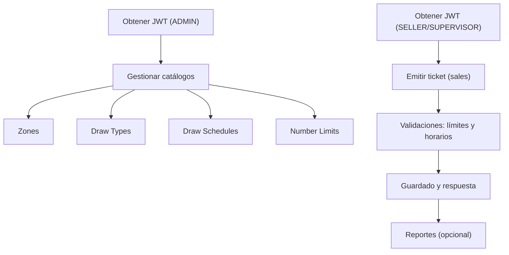

# 🎟️ Sistema de Emisión y Gestión de Tickets

Plataforma para gestionar catálogos (zonas, tipos de sorteo, horarios y límites), emisión de tickets y validaciones de negocio, con API basada en Django REST Framework.

## 📋 Índice
- Requisitos
- Instalación
- Ejecución
- Configuración
- Migraciones
- API
- Testing
- Calidad de Código
- CI/CD
- Troubleshooting
- Contribución

## ✅ Requisitos
- Python 3.12
- Docker y Docker Compose (opcional, recomendado)

## ⚙️ Instalación
1. Clona el repositorio y entra al directorio del proyecto.
2. (Opcional) Crea un entorno virtual local:
   ```bash
   python -m venv .venv && source .venv/bin/activate
   ```
3. Instala dependencias:
   ```bash
   pip install -r requirements.txt
   pip install -r requirements-dev.txt
   ```

## 🚀 Ejecución
### Opción A: Docker (recomendada)
```bash
docker compose up -d --build
```
Aplicación disponible en `http://localhost:8000`.

### Opción B: Local
```bash
python manage.py migrate
python manage.py runserver 0.0.0.0:8000
```

## 🛠️ Configuración
Variables de entorno comunes:
- `DJANGO_SETTINGS_MODULE=core.settings`
- `SECRET_KEY=...`
- `DEBUG=true|false`
- `DATABASE_URL=...` (si aplica)

## 🗃️ Migraciones
Generar y aplicar migraciones:
```bash
python manage.py makemigrations
python manage.py migrate
```

## 🔌 API
- API REST con Django REST Framework.
- Endpoints principales (routers):
  - `zones/`
  - `draw-types/`
  - `draw-schedules/`
  - `number-limits/`
- Autenticación JWT (SimpleJWT).
- Permisos: escritura restringida a `ADMIN`/`staff`/`superuser`.

### Prefijos globales
- Catálogo: `/api/catalog/`
- Cuentas: `/api/auth/`
- Ventas: `/api/sales/`

### Ejemplos curl
1) Obtener token JWT
```bash
curl -X POST http://localhost:8000/api/auth/token/ \
  -H "Content-Type: application/json" \
  -d '{"username": "admin", "password": "admin123"}'
```

2) Crear zona (requiere token)
```bash
TOKEN=eyJ... # reemplazar por tu token
curl -X POST http://localhost:8000/api/catalog/zones/ \
  -H "Authorization: Bearer $TOKEN" \
  -H "Content-Type: application/json" \
  -d '{"name": "Zona Norte", "is_active": true}'
```

3) Listar tipos de sorteo
```bash
curl http://localhost:8000/api/catalog/draw-types/
```

4) Crear horario de sorteo (upsert por zona+tipo)
```bash
curl -X POST http://localhost:8000/api/catalog/draw-schedules/ \
  -H "Authorization: Bearer $TOKEN" \
  -H "Content-Type: application/json" \
  -d '{"zone": 1, "draw_type": 1, "cutoff_time": "18:00:00", "is_active": true}'
```

5) Establecer límite de número
```bash
curl -X POST http://localhost:8000/api/catalog/number-limits/ \
  -H "Authorization: Bearer $TOKEN" \
  -H "Content-Type: application/json" \
  -d '{"zone": 1, "draw_type": 1, "number": "12", "max_pieces": 100}'
```

### Ejemplos de actualización y borrado (PATCH/DELETE)
1) Actualizar zona
```bash
curl -X PATCH http://localhost:8000/api/catalog/zones/1/ \
  -H "Authorization: Bearer $TOKEN" \
  -H "Content-Type: application/json" \
  -d '{"name": "Zona Norte Actualizada", "is_active": true}'
```

2) Borrar tipo de sorteo
```bash
curl -X DELETE http://localhost:8000/api/catalog/draw-types/1/ \
  -H "Authorization: Bearer $TOKEN"
```

3) Actualizar límite de número
```bash
curl -X PATCH http://localhost:8000/api/catalog/number-limits/1/ \
  -H "Authorization: Bearer $TOKEN" \
  -H "Content-Type: application/json" \
  -d '{"max_pieces": 150}'
```

4) Borrar horario de sorteo
```bash
curl -X DELETE http://localhost:8000/api/catalog/draw-schedules/1/ \
  -H "Authorization: Bearer $TOKEN"
```

### Diagrama de flujo (alto nivel)


## 🧾 Ventas (sales)
Prefijo: `/api/sales/`

### Crear ticket
```bash
curl -X POST http://localhost:8000/api/sales/tickets/ \
  -H "Authorization: Bearer $TOKEN" \
  -H "Content-Type: application/json" \
  -d '{
    "zone": 1,
    "draw_type": 1,
    "items": [
      {"number": "12", "pieces": 3},
      {"number": "34", "pieces": 2}
    ]
  }'
```

Respuestas esperadas:
- 201 Created con `{ id, total_pieces, ... }`
- 400 Bad Request si:
  - No hay `draw-schedule` activo para la zona/sorteo
  - Se excede el tope acumulado de `number-limits`
  - `items` vacío o con valores inválidos (número no 00-99, piezas <= 0)

### Reporte resumen
```bash
curl "http://localhost:8000/api/sales/tickets/reports/summary/?group_by=zone"
```

Parámetros soportados:
- `group_by`: `zone` | `draw_type` | `user`
- Filtros: `start`, `end`, `zones`, `draws`, `users`, `daily`, `page`, `page_size`

#### Ejemplos de filtros combinados
1) Por zona + rango de fechas + múltiples zonas + desglose diario
```bash
curl "http://localhost:8000/api/sales/tickets/reports/summary/?group_by=zone&start=2024-01-01&end=2024-01-31&zones=1,2&daily=1"
```

2) Por tipo de sorteo + filtro por usuario + paginación
```bash
curl "http://localhost:8000/api/sales/tickets/reports/summary/?group_by=draw_type&users=7&page=2&page_size=5"
```

3) Por usuario + filtros de zona y sorteo específicos
```bash
curl "http://localhost:8000/api/sales/tickets/reports/summary/?group_by=user&zones=1&draws=2,3"
```

4) Combinado completo (fechas + zona + sorteo + usuario)
```bash
curl "http://localhost:8000/api/sales/tickets/reports/summary/?group_by=zone&start=2024-06-01&end=2024-06-30&zones=1&draws=3&users=10"
```

### Exportación
```bash
curl "http://localhost:8000/api/sales/tickets/reports/export/?format=csv&group_by=zone"
curl "http://localhost:8000/api/sales/tickets/reports/export/?format=excel&group_by=zone"
```

#### Exportación con filtros combinados
1) CSV por zona + fechas específicas
```bash
curl "http://localhost:8000/api/sales/tickets/reports/export/?format=csv&group_by=zone&start=2024-01-01&end=2024-01-31"
```

2) Excel por tipo de sorteo + filtro de zona
```bash
curl "http://localhost:8000/api/sales/tickets/reports/export/?format=excel&group_by=draw_type&zones=1,2"
```

3) CSV por usuario + filtros múltiples
```bash
curl "http://localhost:8000/api/sales/tickets/reports/export/?format=csv&group_by=user&zones=1&draws=2&start=2024-06-01"
```

4) Excel con desglose diario
```bash
curl "http://localhost:8000/api/sales/tickets/reports/export/?format=excel&group_by=zone&daily=1&start=2024-06-01&end=2024-06-30"
```

### PDF del ticket
```bash
curl -L "http://localhost:8000/api/sales/tickets/123/pdf/" -o ticket-123.pdf
curl "http://localhost:8000/api/sales/tickets/123/preview/"
```

## 🧪 Testing
Suite que valida modelos, serializers, viewsets, permisos y flujos de integración.

## ⚡ Comandos rápidos
- Iniciar app (Docker): `docker compose up -d --build`
- Migraciones: `python manage.py makemigrations && python manage.py migrate`
- Tests rápidos: `python manage.py test -v 2`
- Tests por módulo: `python manage.py test catalog.tests -v 2`
- Lint+formato: `flake8 && black . && isort .`
- Borrar caché Python: `find . -type d -name "__pycache__" -exec rm -r {} +`

### Ejecutar todos los tests
```bash
python manage.py test -v 2
```

### Ejecutar por módulo/archivo
```bash
python manage.py test accounts.tests -v 2
python manage.py test catalog.tests -v 2
python manage.py test sales.tests -v 2
python manage.py test sales.tests_advanced -v 2
python manage.py test tests_integration -v 2
python manage.py test test_simple -v 2
```

### Ejecutar por clase/test específico
```bash
python manage.py test catalog.tests.ZoneViewSetTests -v 2
python manage.py test catalog.tests.ZoneViewSetTests.test_update_zone -v 2
```

### Pytest (opcional)
```bash
pytest
# Con cobertura
pytest --cov=accounts --cov=catalog --cov=sales --cov-report=term-missing
```

## 🎨 Frontend (Repositorio Separado)

El frontend del dashboard de administración está en un repositorio separado: **[tickets-admin-frontend](https://github.com/tu-usuario/tickets-admin-frontend)**

### Características del Frontend
- **Vue.js 3** con Composition API
- **Tailwind CSS** para estilos
- **Pinia** para gestión de estado
- **Chart.js** para gráficos
- **Diseño responsive** para móvil y desktop

### Desarrollo del Frontend
```bash
# Clonar repositorio frontend
git clone https://github.com/tu-usuario/tickets-admin-frontend.git
cd tickets-admin-frontend

# Instalar dependencias
npm install

# Ejecutar en desarrollo
npm run dev

# Construir para producción
npm run build
```

### Mover Frontend a Repositorio Separado
Si necesitas separar el frontend del repositorio actual:

```bash
# Ejecutar script de separación
./scripts/move_frontend.sh [ruta_destino]

# Ejemplo: mover a ../tickets-admin-frontend
./scripts/move_frontend.sh ../tickets-admin-frontend
```

## 🧹 Calidad de Código
```bash
flake8 accounts catalog sales --max-line-length=88
black accounts catalog sales
isort accounts catalog sales
bandit -r accounts catalog sales
```

## 🔄 CI/CD (ejemplo GitHub Actions)
```yaml
name: Tests
on: [push, pull_request]
jobs:
  test:
    runs-on: ubuntu-latest
    steps:
      - uses: actions/checkout@v3
      - uses: actions/setup-python@v4
        with:
          python-version: '3.12'
      - name: Install dependencies
        run: |
          pip install -r requirements.txt
          pip install -r requirements-dev.txt
      - name: Run tests
        run: python manage.py test -v 2
```

## 🐛 Troubleshooting
- Usa siempre `manage.py test` para cargar `DJANGO_SETTINGS_MODULE` y evitar errores tipo:
  `ImproperlyConfigured: Requested setting REST_FRAMEWORK ...`.
- Si hay inconsistencias en la BD de tests, el runner recrea la DB automáticamente.
- Limpia caché de Python si ves comportamientos extraños:
  ```bash
  find . -type d -name "__pycache__" -exec rm -r {} +
  ```

## ❓ FAQ
- ¿Cómo evito el error de settings en tests?  
  Ejecuta siempre con `python manage.py test ...` (no ejecutes archivos de test directamente).
- ¿Por qué recibo 403 en endpoints de catálogo?  
  Acciones de escritura requieren `ADMIN`/`staff`/`superuser`. Asegúrate de enviar un JWT válido.
- ¿Cómo ejecuto un solo test?  
  `python manage.py test catalog.tests.ZoneViewSetTests.test_update_zone -v 2`
- ¿Cómo creo datos mínimos?  
  Usa los endpoints `zones/`, `draw-types/` y luego `draw-schedules/` para horarios.

## 🗺️ Roadmap

### Fase 1: Funcionalidades Core (Q2 2024) ✅
- ✅ Sistema de autenticación JWT
- ✅ Gestión de catálogos (zonas, tipos de sorteo, horarios, límites)
- ✅ Emisión de tickets con validaciones de negocio
- ✅ Sistema de permisos por roles
- ✅ Tests unitarios y de integración
- ✅ API REST completa

### Fase 2: Mejoras y Optimizaciones (Q3 2024) 🚧
- 🔄 Cache Redis para reportes frecuentes
- 🔄 Validaciones de negocio más robustas
- 🔄 Sistema de auditoría y logs
- 🔄 API rate limiting
- 🔄 Tests de rendimiento y carga
- 🔄 Documentación de API con Swagger/OpenAPI
- 🔄 Monitoreo y métricas con Prometheus
- 🔄 **Frontend Vue.js 3 + Composition API** *(repositorio separado)*
- 🔄 **Dashboard responsive para administradores** *(repositorio separado)*
- 🔄 **Interfaz de vendedores para emisión de tickets** *(repositorio separado)*
- 🔄 **Sistema de autenticación frontend** *(repositorio separado)*
- 🔄 **Gestión de catálogos con UI intuitiva** *(repositorio separado)*
- 🔄 **Componentes Vue reutilizables y librería UI** *(repositorio separado)*
- 🔄 **Tests E2E con Cypress/Playwright** *(repositorio separado)*
- 🔄 **Optimización de rendimiento frontend** *(repositorio separado)*

### Fase 3: Escalabilidad y Nuevas Funcionalidades (Q4 2024) 📋
- 📋 Sistema de notificaciones en tiempo real
- 📋 Integración con sistemas externos (pagos, SMS)
- 📋 App móvil para vendedores
- 📋 Análisis avanzado con machine learning
- 📋 Sistema de backup automático
- 📋 Microservicios y contenedores
- 📋 CI/CD pipeline completo
- 📋 Tests de seguridad automatizados
- 📋 **PWA (Progressive Web App) para vendedores** *(repositorio separado)*
- 📋 **Internacionalización (i18n) multiidioma** *(repositorio separado)*
- 📋 **Integración continua frontend-backend**
- 📋 **Sistema de deployment automático**

## 🤝 Contribución
- Agrega tests para toda nueva funcionalidad.
- Mantén cobertura ≥80%.
- Sigue el estilo (black, isort, flake8).
- Ejecuta la suite completa antes de enviar PR.
